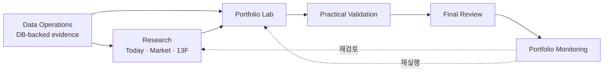
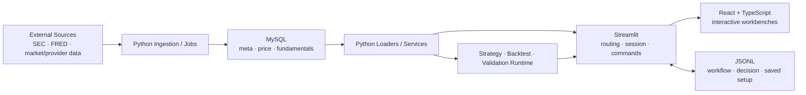

# README Product / Onboarding Overhaul V1 Design

Status: Written Spec Awaiting User Review
Last Updated: 2026-07-25

## Product Positioning

README의 첫 정의는 다음 의미를 전달한다.

> Quant Data Pipeline은 시장 조사, 전략 실험, 실전 검증, 최종 판단, 선정 이후 모니터링을
> DB-backed evidence로 연결하는 Evidence-first 퀀트 투자 리서치 워크스페이스다.

제품은 자동매매, 투자 승인, broker 주문 또는 수익 보장 시스템으로 표현하지 않는다.

## Audience

균형형 README를 사용한다.

- 앞부분: 실제 사용자가 제품 가치와 화면 흐름을 이해한다.
- 뒷부분: 개발자가 실행 방법, 구현 언어, 계층 책임, 저장 경계와 검증 방법을 이해한다.

두 독자를 별도 문서처럼 완전히 분리하지 않고 제품 여정에서 기술 구조로 자연스럽게 내려간다.

## Selected Approach

`제품 여정 우선형`을 채택한다.

다른 접근보다 다음 이유로 현재 제품에 맞다.

- 제품의 핵심은 독립 기능 목록이 아니라 Research에서 Monitoring까지의 evidence handoff다.
- 사용자에게 제품 가치를 먼저 설명하면서 개발자 온보딩도 같은 문서에서 이어갈 수 있다.
- 압축형 문서 허브보다 상세하고, 제품 / 개발 2부 구성보다 중복이 적다.

## Target Information Architecture

README는 다음 순서를 사용한다.

1. 제품 한 문장 정의, 비범위 요약, Today 대표 화면
2. 왜 이 프로젝트를 만들었는가
3. 현재 무엇을 할 수 있는가
4. 제품 사용 흐름
5. 5분 빠른 시작
6. 기술 스택과 구현 방식
7. 프로젝트 구조
8. 데이터 신뢰성과 투자 경계
9. 개발과 검증
10. 상세 문서와 현재 상태

## Product Surface Contract

각 화면은 내부 모듈 목록보다 “사용자가 무엇을 끝낼 수 있는가”를 기준으로 2~3문장 안에서 설명한다.

| Surface | README responsibility |
|---|---|
| `Today` | 미국 시장 세션, 시장 상태, 대표 포트폴리오 변화와 우선 확인 항목을 한 화면에서 파악한다. |
| `Market Research` | 경제 사이클, 지수 가치평가, 개별 종목, 변동 종목, 거시·심리·일정을 source와 기준일이 보이는 상태로 조사한다. |
| `Institutional Holdings` | delayed SEC Form 13F로 기관별 배분, 보유 변화, 섹터 노출과 종목별 보유 기관을 탐색한다. |
| `Portfolio Lab` | 전략을 실행·비교하고 portfolio mix를 구성해 검증 대상으로 넘길 후보를 만든다. |
| `Practical Validation` | 데이터 품질, 실전 운용성, provider·holdings·macro·stress·robustness 근거와 보강 필요 항목을 확인한다. |
| `Final Review` | 검증 근거를 종합해 선정·보류·거절·재검토 판단을 기록한다. |
| `Portfolio Monitoring` | 선정 후보와 직접 등록한 종목·ETF를 그룹으로 추적하고 성과, 기여도, 보유 변화와 재검토 조건을 확인한다. |
| `Data Operations` | 가격·재무·거시·provider·기관 보유 데이터를 DB에 수집하고 데이터 준비 상태를 관리한다. |
| `Reference Center` | 현재 화면의 개념, 기준, 제한과 관련 화면 이동 경로를 검색한다. |

`Practical Validation`과 `Final Review`는 top-level `Portfolio Lab` 내부 workflow stage로 설명하고,
top navigation 수를 과장하지 않는다.

## Product Workflow

Data Operations를 선형 첫 단계가 아니라 전체 workflow의 DB-backed evidence layer로 표현한다.



## Representative Visual

- 대표 화면은 app default entry인 `Today`를 사용한다.
- 첫 방문자가 매일 무엇을 먼저 확인하는 제품인지 보여준다.
- 전체 범위는 대표 화면 아래 product workflow가 보완한다.
- asset은 `.aiworkspace/note/finance/docs/assets/readme/` 아래에 둔다.
- 일반 QA screenshot을 재사용하지 않고 README용 안정적인 viewport와 상태로 새로 캡처한다.
- 사용자가 README 대표 이미지 포함을 명시적으로 승인했으므로 이 asset은 commit 대상이다.

## Five-Minute Start

빠른 시작의 완료 조건은 앱 process와 Today route가 열리는 것이다.

```bash
uv sync
uv run streamlit run app/web/streamlit_app.py
```

- Python 3.12+와 `uv`는 runtime prerequisite다.
- MySQL 8 계열 local instance는 DB-backed 기능에 필요하다.
- committed React `component_static` bundle을 사용하므로 Node.js / npm은 일반 앱 실행 prerequisite가 아니다.
- Node.js / npm은 React component 수정, test, typecheck, build에만 필요하다.
- `.env`는 FRED 등 외부 provider 수집 기능을 위한 선택적 설정으로 설명한다.
- 빈 DB에서도 app entry와 데이터 부족 상태 확인까지를 quick start로 본다.
- schema와 초기 data collection은 Data Operations 및 canonical runbook으로 연결한다.

현재 DB 연결은 통합 환경변수 config가 아니라 여러 data / service 경로의 local default contract를 사용한다.
README는 이를 환경변수 기반 통합 설정처럼 표현하지 않는다.

## Technology And Ownership

### Python 3.12+

- ingestion, DB access, point-in-time calculation, strategy, backtest, validation, read model을 소유한다.
- 주요 위치는 `finance/`, `app/jobs/`, `app/services/`, `app/runtime/`이다.

### Streamlit

- app navigation, page routing, session state, Python command orchestration을 소유한다.
- React payload와 small event envelope의 server boundary를 소유한다.
- business data를 presentation-only React에 위임하지 않는다.

### React 18 + TypeScript 5 + Vite

- Today, Market Research, Institutional Holdings, Portfolio Monitoring과 Backtest workflow의 상호작용이 많은 workbench를 렌더링한다.
- local selection, chart, responsive presentation을 담당한다.
- DB / provider를 직접 호출하거나 canonical validation / decision을 계산하지 않는다.
- Vite는 Streamlit이 local path로 로드하는 committed production bundle을 만든다.

### MySQL

- 가격, 재무제표, 거시, provider, 기관 보유, monitoring data의 canonical DB source다.
- 주요 schema 의미는 `finance_meta`, `finance_price`, `finance_fundamental`로 설명한다.

### JSONL

- workflow source, validation result, Final Review decision, reusable saved setup을 저장한다.
- `registries/`는 append-only 제품 기록, `saved/`는 사용자 setup, `run_history/`는 local runtime artifact로 구분한다.

## Architecture Diagram



## Repository Map

README의 tree는 다음 경계만 보여준다.

- `app/jobs`: ingestion / automation / execution jobs
- `app/services`: Streamlit-free application read model과 command boundary
- `app/runtime`: Backtest 및 runtime orchestration
- `app/web`: Streamlit pages, adapters, React component boundary
- `finance/data`: collectors, provider adapters, MySQL persistence
- `finance/loaders`: DB-backed read path
- `finance/transform.py`, `strategy.py`, `engine.py`, `performance.py`: 전략 계층
- `app/web/streamlit_components`, `app/web/components/*/frontend`: React / TypeScript workbench
- `.aiworkspace/note/finance`: durable docs, task / phase / research, reports, registries, saved setup

세부 script map은 `PROJECT_MAP.md`와 architecture docs로 연결한다.

## Evidence And Investment Boundary

README는 다음을 제품 원칙으로 명시한다.

- point-in-time correctness 우선
- look-ahead bias와 survivorship bias 경계
- source, freshness, partial / stale / unavailable state 공개
- `NOT_RUN`과 자료 부족은 pass가 아님
- macro, sentiment, 13F는 context / research evidence이며 trade signal이 아님
- live approval, broker order, auto rebalance, return guarantee는 non-goal

## Development Verification

README에는 계층별 대표 검증만 둔다.

- Python domain / service contract: `pytest`
- React state / presentation: Vitest 또는 Node test
- TypeScript boundary: `npm run typecheck`
- deployable React bundle: `npm run build`
- shared hygiene: `git diff --check`

component별 전체 명령은 runbook과 해당 task 문서로 연결한다.

## Maintenance Policy

- README에 active task나 최근 완료 목록을 복제하지 않는다.
- current work는 `docs/ROADMAP.md`, active task index와 manifest로 연결한다.
- schema SQL, provider별 수집 절차, 모든 React build 명령을 복제하지 않는다.
- navigation, surface name, app command, major ownership boundary가 바뀌면 README를 검토한다.
- README의 상대 link는 canonical durable docs를 향한다.
- “현재 개발 초점”처럼 빠르게 낡는 snapshot section은 제거한다.

## Files In Scope

- `README.md`
- `.aiworkspace/note/finance/docs/assets/readme/finance-console-today.jpg`
- `.aiworkspace/note/finance/tasks/active/readme-product-onboarding-overhaul-v1-20260725/*`
- `.aiworkspace/note/finance/WORK_PROGRESS.md`
- `.aiworkspace/note/finance/QUESTION_AND_ANALYSIS_LOG.md`

필요할 때 task index / manifest의 current pointer를 최소 수정한다.

## Verification Contract

- 실제 `app/web/streamlit_app.py` navigation과 README surface 명칭 대조
- Today actual browser screenshot과 representative-state 확인
- quick-start command 실행 또는 동등한 live process 확인
- README local relative link 존재 검사
- Markdown code fence와 Mermaid block 구조 검사
- `git diff --check`
- stage 대상에 registry / saved / run history / 기존 QA artifact가 없는지 확인

## Approval Record

사용자가 다음을 순서대로 승인했다.

- 사용자 / 개발자 균형형
- 5분 실행 경로 + 상세 runbook handoff
- 구현 language와 방법 / 책임 경계 포함
- 대표 화면 1장 + workflow diagram
- Evidence-first 퀀트 투자 리서치 워크스페이스 포지셔닝
- 제품 여정 우선형 구성
- 정보구조, 화면 설명, quick start / architecture, 신뢰 / 유지 정책과 4차 roadmap
