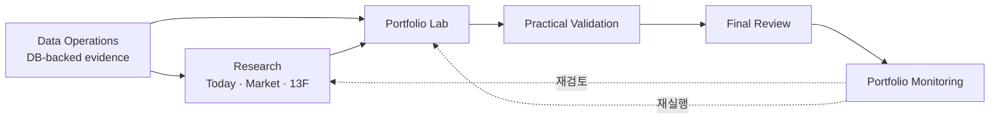

# README Product / Onboarding Overhaul V1 Implementation Plan

> **For agentic workers:** REQUIRED SUB-SKILL: Use superpowers:subagent-driven-development (recommended) or superpowers:executing-plans to implement this plan task-by-task. Steps use checkbox (`- [ ]`) syntax for tracking.

**Goal:** root README를 제품 이해, 실제 사용 흐름, 5분 실행, 구현 구조와 상세 문서로 이어지는 Evidence-first 퀀트 투자 리서치 워크스페이스의 최신 진입점으로 전면 개편한다.

**Architecture:** README는 product journey first 구조를 사용하고, 상세 schema·수집·active task 상태는 canonical finance 문서로 연결한다. Today 대표 화면 1장과 두 개의 Mermaid diagram으로 제품 경험과 Python / Streamlit / React / MySQL 경계를 설명한다.

**Tech Stack:** Markdown, Mermaid, Python 3.12+, Streamlit, React 18, TypeScript 5, Vite, MySQL, JSONL, in-app Browser QA

## Global Constraints

- 기본 문서는 한국어로 쓰고 실제 route, package, contract 이름은 현재 코드의 영어 이름을 유지한다.
- 제품 포지셔닝은 `Evidence-first 퀀트 투자 리서치 워크스페이스`다.
- 제품 runtime scope는 `finance` package와 Streamlit Finance Console이며 `financial_advisor`는 확장하지 않는다.
- current top navigation은 `Research / Portfolio / Data / Help`다.
- quick start는 `uv sync`와 `uv run streamlit run app/web/streamlit_app.py`를 사용한다.
- Node.js / npm은 React 수정·검증·build dependency이며 일반 앱 실행 prerequisite가 아니다.
- Data Operations는 전 workflow를 받치는 DB-backed evidence layer로 설명한다.
- React는 DB / provider 직접 호출, canonical validation / decision 계산, persistence를 소유하지 않는다.
- registry / saved JSONL, run history, 기존 QA artifact를 변경하거나 stage하지 않는다.
- active task와 최근 완료 목록을 README에 복제하지 않는다.
- live approval, broker order, auto rebalance, return guarantee는 non-goal이다.

---

## 이걸 하는 이유?

현재 root `README.md`는 2026-05-13 기준의 Backtest 중심 프로토타입 설명에 머물러 있다.
실제 제품은 Today, Market Research, Institutional Holdings, Portfolio Lab, Portfolio Monitoring,
Data Operations, Reference Center를 `Research / Portfolio / Data / Help` navigation으로 제공한다.

새 README는 제품 기능을 나열하는 문서가 아니라 다음 두 독자의 공통 진입점이어야 한다.

- 사용자는 제품이 해결하는 문제와 실제 조사·검증·판단·모니터링 흐름을 이해한다.
- 개발자는 앱을 실행하고 구현 언어, 계층 책임, 저장 경계와 검증 문서를 따라간다.

## Files And Responsibilities

### Modify

- `README.md`
  - 제품 정의, 화면 지도, workflow, quick start, architecture, repository map, trust / non-goal, verification, docs hub를 소유한다.
- `.aiworkspace/note/finance/tasks/active/readme-product-onboarding-overhaul-v1-20260725/PLAN.md`
  - 실행 체크리스트와 round 상태를 소유한다.
- `.aiworkspace/note/finance/tasks/active/readme-product-onboarding-overhaul-v1-20260725/STATUS.md`
  - 현재 완료 차수와 다음 action을 소유한다.
- `.aiworkspace/note/finance/tasks/active/readme-product-onboarding-overhaul-v1-20260725/NOTES.md`
  - 구현 중 발견과 결정만 기록한다.
- `.aiworkspace/note/finance/tasks/active/readme-product-onboarding-overhaul-v1-20260725/RUNS.md`
  - 실행 명령과 핵심 결과를 기록한다.
- `.aiworkspace/note/finance/tasks/active/readme-product-onboarding-overhaul-v1-20260725/RISKS.md`
  - 남은 검증 공백과 follow-up을 기록한다.
- `.aiworkspace/note/finance/WORK_PROGRESS.md`
  - 완료 milestone과 다음 task 위치를 3~5줄로 기록한다.
- `.aiworkspace/note/finance/QUESTION_AND_ANALYSIS_LOG.md`
  - 사용자 요청, 해석, 결론, follow-up을 압축 기록한다.

### Create

- `.aiworkspace/note/finance/docs/assets/readme/finance-console-today.png`
  - README의 유일한 대표 제품 화면을 소유한다.

### Read-Only Sources Of Truth

- `app/web/streamlit_app.py`
- `pyproject.toml`
- `.python-version`
- `app/web/streamlit_components/*/package.json`
- `.aiworkspace/note/finance/docs/PRODUCT_DIRECTION.md`
- `.aiworkspace/note/finance/docs/ROADMAP.md`
- `.aiworkspace/note/finance/docs/PROJECT_MAP.md`
- `.aiworkspace/note/finance/docs/architecture/`
- `.aiworkspace/note/finance/docs/data/`
- `.aiworkspace/note/finance/docs/flows/`
- `.aiworkspace/note/finance/docs/runbooks/`

---

### Task 1: 제품 서사와 현재 사용자 흐름 재작성

**Files:**

- Modify: `README.md`
- Modify: `.aiworkspace/note/finance/tasks/active/readme-product-onboarding-overhaul-v1-20260725/STATUS.md`
- Modify: `.aiworkspace/note/finance/tasks/active/readme-product-onboarding-overhaul-v1-20260725/RUNS.md`

**Interfaces:**

- Consumes: `app/web/streamlit_app.py`의 current navigation, `DESIGN.md`의 product surface contract
- Produces: README의 product definition, surface map, user workflow; Task 2의 기술 설명이 이어질 product context

- [x] **Step 1: 기존 README drift assertion 실행**

Run:

```bash
rg -n "Workspace|Operations|Selected Portfolio Dashboard|현재 개발 초점" README.md
```

Expected: 옛 navigation / surface / snapshot 표현이 발견된다.

- [x] **Step 2: README 앞부분을 product journey first 구조로 재작성**

다음 순서를 실제 본문으로 작성한다.

```text
# Quant Data Pipeline
one-line Evidence-first positioning
non-trading boundary
representative Today image path

## 왜 이 프로젝트를 만들었는가
## 현재 무엇을 할 수 있는가
## 제품 사용 흐름
```

`현재 무엇을 할 수 있는가`는 `Today`, `Market Research`, `Institutional Holdings`,
`Portfolio Lab`, `Portfolio Monitoring`, `Data Operations`, `Reference Center`를 설명하고,
Practical Validation / Final Review는 Portfolio Lab 내부 stage로 설명한다.

- [x] **Step 3: Product workflow Mermaid 작성**

README에 다음 ownership을 반영한 Mermaid를 작성한다.



- [x] **Step 4: 현재 화면명 assertion 실행**

Run:

```bash
for label in "Today" "Market Research" "Institutional Holdings" "Portfolio Lab" "Portfolio Monitoring" "Data Operations" "Reference Center"; do
  rg -q "$label" README.md || exit 1
done
! rg -n "Workspace >|Operations >|Selected Portfolio Dashboard" README.md
```

Expected: exit 0, old user-facing navigation 표현 없음.

- [x] **Step 5: 문서 hygiene 확인**

Run:

```bash
git diff --check -- README.md
```

Expected: exit 0.

- [x] **Step 6: 1차 commit**

```bash
git add README.md .aiworkspace/note/finance/tasks/active/readme-product-onboarding-overhaul-v1-20260725/STATUS.md .aiworkspace/note/finance/tasks/active/readme-product-onboarding-overhaul-v1-20260725/RUNS.md
git commit -m "README 제품 흐름 전면 개편"
```

---

### Task 2: 5분 실행과 기술 구현 구조 보강

**Files:**

- Modify: `README.md`
- Modify: `.aiworkspace/note/finance/tasks/active/readme-product-onboarding-overhaul-v1-20260725/STATUS.md`
- Modify: `.aiworkspace/note/finance/tasks/active/readme-product-onboarding-overhaul-v1-20260725/NOTES.md`
- Modify: `.aiworkspace/note/finance/tasks/active/readme-product-onboarding-overhaul-v1-20260725/RUNS.md`

**Interfaces:**

- Consumes: Task 1 product context, committed `component_static` bundles, Python / React package manifests
- Produces: executable quick start, architecture diagram, tech ownership, repository / storage / verification map

- [ ] **Step 1: Runtime prerequisite evidence 재확인**

Run:

```bash
test "$(cat .python-version)" = "3.12"
test -f pyproject.toml
test -d app/web/streamlit_components/today_workbench/component_static
test -f app/web/streamlit_components/today_workbench/package.json
```

Expected: exit 0.

- [ ] **Step 2: 5분 빠른 시작 작성**

README에 다음 명령을 그대로 제공한다.

```bash
uv sync
uv run streamlit run app/web/streamlit_app.py
```

`http://localhost:8501`의 Today 진입을 성공 기준으로 쓰고,
Python / uv, local MySQL, optional provider `.env`, frontend-only Node.js 역할을 구분한다.
schema / initial collection은 Data Operations와 runbook link로 넘긴다.

- [ ] **Step 3: 기술 스택과 ownership 작성**

다음 경계를 명시한다.

```text
Python: ingestion, DB, PIT calculation, strategy, backtest, validation, read model
Streamlit: route, session, command orchestration, React payload / event boundary
React + TypeScript: local interaction, charts, responsive workbench presentation
Vite: committed Streamlit component production bundle
MySQL: meta, price, fundamentals and monitoring canonical data
JSONL: workflow registry, decision record, saved setup, local run history separation
```

- [ ] **Step 4: Architecture Mermaid 작성**

`External Sources -> Python Jobs -> MySQL -> Loaders / Services -> Runtime / Streamlit -> React`
데이터 흐름과 Streamlit / JSONL 양방향 workflow 기록을 그린다.
React에서 DB / provider로 직접 향하는 edge는 만들지 않는다.

- [ ] **Step 5: Repository map, trust boundary, verification, docs hub 작성**

다음 durable section을 작성한다.

```text
## 프로젝트 구조
## 데이터 신뢰성과 투자 경계
## 개발과 검증
## 상세 문서
```

active task snapshot section은 만들지 않고 Roadmap / active task index link만 제공한다.

- [ ] **Step 6: Quick-start command smoke**

기존 localhost app이 실행 중이면 현재 process / route를 확인한다.
실행 중이지 않으면 다음 명령으로 bounded smoke를 수행한다.

```bash
uv run streamlit run app/web/streamlit_app.py --server.headless true --server.port 8511
```

Expected: Streamlit이 import error 없이 기동하고 local URL을 출력한다. 확인 후 test process만 종료한다.

- [ ] **Step 7: Tech / boundary assertion 실행**

Run:

```bash
for label in "Python 3.12" "Streamlit" "React" "TypeScript" "Vite" "MySQL" "JSONL"; do
  rg -q "$label" README.md || exit 1
done
rg -q "uv run streamlit run app/web/streamlit_app.py" README.md
rg -q "point-in-time" README.md
rg -q "look-ahead" README.md
rg -q "survivorship" README.md
```

Expected: exit 0.

- [ ] **Step 8: 2차 commit**

```bash
git add README.md .aiworkspace/note/finance/tasks/active/readme-product-onboarding-overhaul-v1-20260725/
git commit -m "README 실행과 기술 구조 보강"
```

---

### Task 3: Today 대표 화면과 README 시각 자료 연결

**Files:**

- Create: `.aiworkspace/note/finance/docs/assets/readme/finance-console-today.png`
- Modify: `README.md`
- Modify: `.aiworkspace/note/finance/tasks/active/readme-product-onboarding-overhaul-v1-20260725/STATUS.md`
- Modify: `.aiworkspace/note/finance/tasks/active/readme-product-onboarding-overhaul-v1-20260725/RUNS.md`

**Interfaces:**

- Consumes: live `http://localhost:8510/` backtest-dev Today route와 Task 1 README hero
- Produces: repository-relative stable README representative image

- [ ] **Step 1: Browser에서 Today representative state 확인**

확인 항목:

```text
route: backtest-dev `http://localhost:8510/` Today
viewport: desktop 1280px 이상
top navigation: Research / Portfolio / Data / Help
visible first read: market/session context and portfolio summary
no loading overlay
no expanded raw diagnostic panel
no visible secret or local filesystem path
```

- [ ] **Step 2: README 전용 screenshot 저장**

in-app Browser 또는 연결된 browser control로 full-page가 아닌 representative first-read viewport를 캡처해
다음 exact path에 저장한다.

```text
.aiworkspace/note/finance/docs/assets/readme/finance-console-today.png
```

- [ ] **Step 3: README hero에 relative image 연결**

README 첫 설명 바로 아래에 다음 relative asset을 연결한다.

```markdown

```

- [ ] **Step 4: Asset 검증**

Run:

```bash
test -s .aiworkspace/note/finance/docs/assets/readme/finance-console-today.png
file .aiworkspace/note/finance/docs/assets/readme/finance-console-today.png
rg -qF ".aiworkspace/note/finance/docs/assets/readme/finance-console-today.png" README.md
```

Expected: non-empty PNG, README exact relative path 존재.

- [ ] **Step 5: 3차 commit**

```bash
git add README.md .aiworkspace/note/finance/docs/assets/readme/finance-console-today.png .aiworkspace/note/finance/tasks/active/readme-product-onboarding-overhaul-v1-20260725/
git commit -m "README 대표 제품 화면 추가"
```

---

### Task 4: 정합성 검증, durable docs sync, closeout

**Files:**

- Modify: `.aiworkspace/note/finance/tasks/active/readme-product-onboarding-overhaul-v1-20260725/PLAN.md`
- Modify: `.aiworkspace/note/finance/tasks/active/readme-product-onboarding-overhaul-v1-20260725/STATUS.md`
- Modify: `.aiworkspace/note/finance/tasks/active/readme-product-onboarding-overhaul-v1-20260725/NOTES.md`
- Modify: `.aiworkspace/note/finance/tasks/active/readme-product-onboarding-overhaul-v1-20260725/RUNS.md`
- Modify: `.aiworkspace/note/finance/tasks/active/readme-product-onboarding-overhaul-v1-20260725/RISKS.md`
- Modify: `.aiworkspace/note/finance/WORK_PROGRESS.md`
- Modify: `.aiworkspace/note/finance/QUESTION_AND_ANALYSIS_LOG.md`

**Interfaces:**

- Consumes: Tasks 1–3의 README와 representative asset
- Produces: verified final README, `4/4차` task closeout, root handoff

- [ ] **Step 1: README local Markdown link 존재 검사**

Run:

```bash
uv run python - <<'PY'
import pathlib
import re

root = pathlib.Path(".").resolve()
readme = root / "README.md"
text = readme.read_text(encoding="utf-8")
missing = []
for target in re.findall(r"\[[^\]]+\]\(([^)]+)\)", text):
    if "://" in target or target.startswith("#"):
        continue
    path = (root / target.split("#", 1)[0]).resolve()
    if not path.exists():
        missing.append(target)
if missing:
    raise SystemExit("missing README links: " + ", ".join(missing))
print("README local links OK")
PY
```

Expected: `README local links OK`.

- [ ] **Step 2: Markdown / Mermaid structure 검사**

Run:

```bash
uv run python - <<'PY'
from pathlib import Path

text = Path("README.md").read_text(encoding="utf-8")
if text.count("```") % 2:
    raise SystemExit("unbalanced Markdown fences")
if text.count("```mermaid") != 2:
    raise SystemExit("README must contain exactly two Mermaid diagrams")
print("README fences and Mermaid blocks OK")
PY
```

Expected: `README fences and Mermaid blocks OK`.

- [ ] **Step 3: Current app contract 대조**

Run:

```bash
for label in "Research" "Portfolio" "Data" "Help"; do
  rg -q "\"$label\"" app/web/streamlit_app.py || exit 1
  rg -q "$label" README.md || exit 1
done
```

Expected: exit 0.

- [ ] **Step 4: Browser visual QA**

in-app Browser에서 `http://localhost:8510/`의 README가 설명하는 current Today / Market Research / Institutional Holdings /
Portfolio Lab / Portfolio Monitoring / Data Operations / Reference Center route 이름을 대조한다.
README screenshot과 current Today first-read가 같은 제품 shell임을 확인한다.

- [ ] **Step 5: Task / root handoff closeout**

다음 상태를 기록한다.

```text
PLAN: 모든 checkbox 완료
STATUS: Completed, 전체 roadmap 4/4차
RUNS: 명령과 결과
NOTES: final content / maintenance decisions
RISKS: 남은 비차단 gap 또는 none
WORK_PROGRESS: 3~5줄 milestone과 task path
QUESTION_AND_ANALYSIS_LOG: request / interpreted goal / analysis result / follow-up
```

- [ ] **Step 6: Final hygiene와 stage audit**

Run:

```bash
git diff --check
git status --short
git diff --cached --name-only
```

Expected:

```text
diff check exit 0
registry / saved / run_history / unrelated QA artifact not staged
README, representative asset, task docs, two root handoff logs only
```

- [ ] **Step 7: 4차 commit**

```bash
git add README.md \
  .aiworkspace/note/finance/docs/assets/readme/finance-console-today.png \
  .aiworkspace/note/finance/tasks/active/readme-product-onboarding-overhaul-v1-20260725 \
  .aiworkspace/note/finance/WORK_PROGRESS.md \
  .aiworkspace/note/finance/QUESTION_AND_ANALYSIS_LOG.md
git commit -m "README 전면 개편 완료"
```

## Done Criteria

- README의 제품 정의가 `Evidence-first 퀀트 투자 리서치 워크스페이스`로 읽힌다.
- actual top navigation과 7개 top-level surface 명칭이 일치한다.
- Practical Validation / Final Review가 Portfolio Lab 내부 stage로 정확히 설명된다.
- product workflow와 technical architecture Mermaid가 각각 하나씩 존재한다.
- 5분 실행 경로와 frontend-only Node dependency가 구분된다.
- 구현 language, framework, 계층 소유권, DB / JSONL 저장 경계가 설명된다.
- Today representative screenshot이 repository-relative asset으로 표시된다.
- active state snapshot 대신 canonical durable docs로 연결된다.
- local links, fences, Mermaid, current app contract, browser QA, diff check가 통과한다.
- unrelated registry / saved / run history / existing QA artifact는 변경 또는 stage하지 않는다.
