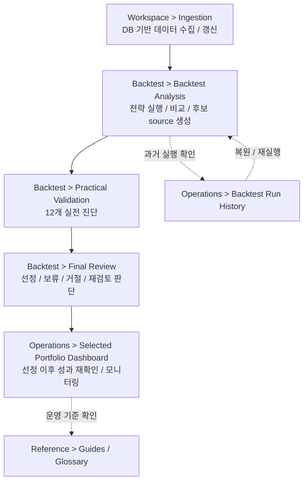

# Quant Data Pipeline

MySQL 기반 데이터 수집, 전략 백테스트, 실전형 검증, 최종 포트폴리오 판단, 선정 이후 모니터링을 한 흐름으로 다루는 퀀트 리서치 워크스페이스입니다.

현재 이 저장소의 active product scope는 `finance` 패키지와 Streamlit 기반 `Finance Console`입니다.
`financial_advisor` 디렉터리는 저장소에 남아 있지만, 별도 요청이 없다면 현재 개발 중심 범위가 아닙니다.

## 이 프로젝트가 하는 일

이 프로젝트의 핵심 질문은 다음입니다.

> 백테스트 결과가 좋아 보이는 전략을 실제로 추적 가능한 포트폴리오 후보로 봐도 되는가?

이를 위해 아래 흐름을 연결합니다.

| 영역 | 역할 |
|---|---|
| 데이터 수집 | 가격, 재무제표, ETF provider, macro context 데이터를 DB에 수집 |
| 전략 백테스트 | ETF / factor strategy family를 재사용 가능한 runtime으로 실행 |
| Practical Validation | 데이터 신뢰도, ETF 운용성, holdings / exposure, macro, stress, sensitivity 진단 |
| Final Review | 선정 / 보류 / 거절 / 재검토 판단과 근거 기록 |
| Selected Portfolio Dashboard | 최종 선정된 포트폴리오를 사용자가 지정한 기간과 가상 투자금으로 재확인 |
| 문서 / 리포트 | 장기 프로젝트 지식, backtest report, task 기록을 `.aiworkspace/note/finance/`에 정리 |

## 하지 않는 일

현재 이 저장소는 아래 기능을 제공하지 않습니다.

- broker account 연결
- live trading 승인
- 자동 주문 생성
- 자동 리밸런싱 실행
- 투자 수익 보장 표현
- 모든 ETF provider endpoint에 대한 universal connector

현재 경계는 리서치, 검증, 최종 판단, 선정 이후 모니터링 지원입니다. 자동 매매 시스템이 아닙니다.

## 프로그램 사용 흐름

사용자-facing 주요 흐름은 아래와 같습니다.



단계별 책임은 아래처럼 나뉩니다.

| 단계 | 책임 |
|---|---|
| `Ingestion` | 백테스트와 검증에 필요한 데이터를 DB에 수집 |
| `Backtest Analysis` | 단일 전략, 비교 실행, saved mix replay로 후보 source 생성 |
| `Practical Validation` | 실전 검토에 필요한 12개 진단과 provider context 확인 |
| `Final Review` | 최종 사용자 판단을 한 번 기록 |
| `Selected Portfolio Dashboard` | 선정 이후 성과와 monitoring signal 확인. 주문 생성은 하지 않음 |

## Finance Console

메인 앱은 Streamlit으로 실행합니다.

```bash
.venv/bin/streamlit run app/web/streamlit_app.py
```

상단 navigation은 아래 기준으로 구성됩니다.

| 그룹 | 화면 |
|---|---|
| `Workspace` | `Overview`, `Ingestion`, `Backtest` |
| `Operations` | `Ops Review`, `Selected Portfolio Dashboard`, `Backtest Run History`, `Candidate Library` |
| `Reference` | `Guides`, `Glossary` |

## 빠른 시작

의존성 설치:

```bash
uv sync
```

앱 실행:

```bash
.venv/bin/streamlit run app/web/streamlit_app.py
```

주의:

- Python `3.12+` 기준입니다.
- 주요 finance workflow는 DB-backed 구조라 로컬 MySQL과 finance schema 데이터가 필요합니다.
- Practical Validation 결과를 신뢰하려면 먼저 Ingestion에서 가격, provider, 재무제표, macro 데이터를 수집해야 합니다.
- runtime artifact, run history, 임시 CSV는 로컬 운영 산출물이며 보통 커밋하지 않습니다.

## 저장소 구조

```text
app/
  jobs/                  # ingestion, diagnostics, run history, artifact helper
  web/                   # Streamlit Finance Console 화면과 UI runtime glue

finance/
  data/                  # data collector, provider connector, DB-backed ingestion
  data/db/               # schema definition, MySQL helper
  loaders/               # backtest / validation runtime용 DB read path
  engine.py              # strategy orchestration
  strategy.py            # portfolio simulation / rebalancing logic
  transform.py           # signal, factor, ranking, preprocessing
  performance.py         # performance metric / summary

.aiworkspace/note/finance/
  docs/                  # 장기 제품 / 구조 / 데이터 / 흐름 / runbook 문서
  tasks/active/          # active task의 계획, 상태, 실행 결과, 리스크
  phases/active/         # phase 단위 통합 계획이 필요할 때 사용
  reports/backtests/     # backtest report, strategy hub, strategy log
  registries/            # append-only workflow JSONL registry
  saved/                 # reusable saved portfolio setup
```

## 문서 지도

먼저 볼 문서는 아래입니다.

| 목적 | 문서 |
|---|---|
| 제품 목표와 경계 확인 | `.aiworkspace/note/finance/docs/PRODUCT_DIRECTION.md` |
| 현재 작업과 로드맵 확인 | `.aiworkspace/note/finance/docs/ROADMAP.md` |
| 코드 위치와 전체 구조 확인 | `.aiworkspace/note/finance/docs/PROJECT_MAP.md` |
| 포트폴리오 선정 사용자 흐름 확인 | `.aiworkspace/note/finance/docs/flows/PORTFOLIO_SELECTION_FLOW.md` |
| Backtest UI와 화면 책임 확인 | `.aiworkspace/note/finance/docs/flows/BACKTEST_UI_FLOW.md` |
| 데이터 / DB 의미와 table boundary 확인 | `.aiworkspace/note/finance/docs/data/README.md` |
| architecture와 code-flow map 확인 | `.aiworkspace/note/finance/docs/architecture/README.md` |
| 실행 명령과 운영 runbook 확인 | `.aiworkspace/note/finance/docs/runbooks/README.md` |
| backtest report와 strategy log 확인 | `.aiworkspace/note/finance/reports/backtests/INDEX.md` |

Codex / agent 작업 전에는 아래도 함께 봅니다.

- `AGENTS.md`
- `.aiworkspace/note/finance/docs/INDEX.md`
- `.aiworkspace/note/finance/tasks/active/README.md`

## 데이터와 저장 경계

finance 시스템은 DB table과 JSONL record를 함께 사용합니다.

| 저장 위치 | 역할 | 정책 |
|---|---|---|
| MySQL `finance_meta` | universe, asset profile, ETF provider snapshot, macro context | metadata / provider context의 DB source |
| MySQL `finance_price` | OHLCV, dividend, split history | price runtime의 DB source |
| MySQL `finance_fundamental` | fundamentals, statements, derived factors | factor workflow의 DB source |
| `.aiworkspace/note/finance/registries/*.jsonl` | workflow source, validation result, decision record | append-only 제품 기록. 임의 재작성 금지 |
| `.aiworkspace/note/finance/saved/*.jsonl` | reusable saved portfolio setup | 명시 요청 없이는 보존 |
| `.aiworkspace/note/finance/run_history/*.jsonl` | local execution history | 보통 커밋하지 않음 |
| `.aiworkspace/note/finance/run_artifacts/` | local job artifact / diagnostics | 보통 커밋하지 않음 |

## 개발 원칙

- Point-in-time correctness를 우선합니다.
- Look-ahead bias와 survivorship bias를 항상 경계합니다.
- UI validation code에서 provider / FRED / issuer page를 직접 fetch하지 않습니다.
- 기본 흐름은 `Ingestion -> DB -> Loader -> Runtime -> UI`입니다.
- strategy logic은 `transform`, `strategy`, `engine`, `performance` 계층을 가능한 유지합니다.
- generated artifact, run history, local scratch file, `.DS_Store`, Playwright output은 명시 요청 없이는 커밋하지 않습니다.

## 현재 개발 초점

현재 finance 작업 상태는 `.aiworkspace/note/finance/docs/ROADMAP.md`와 `.aiworkspace/note/finance/tasks/active/`에서 확인합니다.

이 README 갱신 시점의 active 방향은 아래입니다.

- Practical Validation V2 provider / macro / stress diagnostics closeout
- `.aiworkspace/note/finance/docs/` 기반 새 문서 체계 정착
- `Backtest Analysis -> Practical Validation -> Final Review -> Selected Portfolio Dashboard`로 이어지는 Portfolio Selection V2 흐름 정리

README는 상세 진행 로그가 아니라 첫 관문 문서입니다. 최신 작업 상태는 roadmap과 active task 문서를 기준으로 봅니다.
