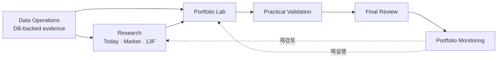

# Quant Data Pipeline

시장 조사, 전략 실험, 실전 검증, 최종 판단, 선정 이후 모니터링을
DB-backed evidence로 연결하는 **Evidence-first 퀀트 투자 리서치 워크스페이스**입니다.

> 좋은 백테스트를 찾는 데서 끝나지 않고, 그 결과를 실제로 계속 관찰할 후보로 받아들여도 되는지 근거와 함께 판단합니다.

현재 active product scope는 `finance` 패키지와 Streamlit 기반 `Finance Console`입니다.
이 프로젝트는 리서치와 의사결정을 지원하지만 broker 연결, 실제 주문, 자동 리밸런싱 또는 수익 보장을 제공하지 않습니다.

## 왜 이 프로젝트를 만들었는가

백테스트 수익률 하나만으로는 실제 추적 가능한 포트폴리오를 고르기 어렵습니다.

- 같은 성과라도 가격·재무·universe 데이터의 기준 시점과 coverage가 다를 수 있습니다.
- 거래 비용, 유동성, ETF holdings, 집중도, stress와 robustness를 확인하지 않으면 실전 운용 가능성을 과대평가할 수 있습니다.
- 시장 환경과 기관 보유 정보는 중요한 배경이지만, 그 자체가 매수·매도 신호나 투자 승인은 아닙니다.
- 후보를 선정한 뒤에도 실제 성과, 종목별 기여, 보유 변화와 재검토 조건을 계속 확인해야 합니다.

Quant Data Pipeline은 이 문제를 `Research → Portfolio Lab → Practical Validation → Final Review → Portfolio Monitoring`의 하나의 흐름으로 다룹니다. 각 단계는 다음 단계가 사용할 근거를 만들며, 실행 결과와 판단 기록은 DB와 명시적인 workflow record 경계를 통해 보존됩니다.

## 현재 무엇을 할 수 있는가

Finance Console의 현재 상단 navigation은 `Research / Portfolio / Data / Help`입니다.

| 영역 | 화면 | 사용자가 끝낼 수 있는 일 |
|---|---|---|
| `Research` | `Today` | 미국 시장 세션, 시장 상태, 대표 포트폴리오 변화와 우선 확인 항목을 첫 화면에서 파악합니다. |
| `Research` | `Market Research` | 경제 사이클, 지수 가치평가, 개별 종목, 변동 종목, 거시·심리·일정을 source와 기준일이 보이는 상태로 조사합니다. |
| `Research` | `Institutional Holdings` | delayed SEC Form 13F로 기관별 자산 배분, 보유 변화, 섹터 노출과 종목별 보유 기관을 탐색합니다. |
| `Portfolio` | `Portfolio Lab` | 전략을 실행·비교하고 portfolio mix를 구성한 뒤 Practical Validation과 Final Review까지 이어갑니다. |
| `Portfolio` | `Portfolio Monitoring` | 선정 후보와 직접 등록한 미국 주식·ETF를 그룹으로 추적하고 성과, 기여도, 보유 변화와 재검토 조건을 확인합니다. |
| `Data` | `Data Operations` | 가격, 재무제표, 거시, ETF provider, 기관 보유 데이터를 MySQL에 수집하고 데이터 준비 상태를 관리합니다. |
| `Help` | `Reference Center` | 제품 개념, 판단 기준, 데이터 제한, 문제 해결 방법과 관련 화면 이동 경로를 검색합니다. |

### Research

`Today`는 매일의 출발점입니다. 미국 시장의 현재 세션과 주요 시장 맥락, 대표 포트폴리오의 최근 변화를 한 번에 읽고 더 깊게 확인할 Research 또는 Portfolio 화면으로 이동합니다.

`Market Research`는 `시장 환경 / 지수 가치평가 / 종목 리서치`를 중심으로 경제 사이클, futures macro, sentiment, events, market movers와 미국 주식 분석을 제공합니다. 저장된 DB evidence와 freshness를 사용하며 자료가 없거나 오래된 상태를 숨기지 않습니다.

`Institutional Holdings`는 SEC Form 13F 공식 data set을 DB에 저장한 뒤 기관별 portfolio와 종목별 보유 기관을 탐색하는 read-only research studio입니다. 13F의 보고 지연, long holdings 중심 범위와 CUSIP-symbol mapping 한계를 항상 함께 봅니다.

### Portfolio

`Portfolio Lab`은 세 단계로 구성됩니다.

1. **Backtest Analysis** — 단일 전략 또는 portfolio mix를 실행하고 비교해 후보 source를 만듭니다.
2. **Practical Validation** — 데이터 신뢰도, 실전 운용성, provider·holdings·macro·stress·robustness 근거와 보강 필요 항목을 확인합니다.
3. **Final Review** — 검증 근거를 종합해 계속 추적, 관찰 후 재검토, 추적 제외 또는 Level 2 재검토 판단을 기록합니다.

`Portfolio Monitoring`은 최종 선정 이후의 read-only 운영 화면입니다. 공통 기준 성과, 종목별 기여, 가격과 보유 변화, diagnosis와 재검토 조건을 확인하지만 주문을 만들거나 자동으로 리밸런싱하지 않습니다.

### Data와 Help

`Data Operations`는 제품 전체를 받치는 evidence 준비 화면입니다. UI에서 provider를 직접 호출해 즉석 계산하지 않고, 수집한 원천 데이터를 MySQL에 저장한 뒤 loader와 service를 통해 Research와 Portfolio workflow에 전달합니다.

`Reference Center`는 별도 매뉴얼을 찾아다니지 않고 현재 화면에서 사용하는 용어, 데이터 기준, 상태 의미와 다음 이동 위치를 검색하는 제품 내 도움말입니다.

## 제품 사용 흐름

```mermaid
flowchart LR
    D["Data Operations<br/>DB-backed evidence"] --> R["Research<br/>Today · Market · 13F"]
    D --> L["Portfolio Lab"]
    R --> L
    L --> V["Practical Validation"]
    V --> F["Final Review"]
    F --> M["Portfolio Monitoring"]
    M -. "재검토" .-> R
    M -. "재실행" .-> L
```

Data Operations는 반드시 처음 한 번만 거치는 설치 단계가 아니라 모든 화면에 근거를 공급하는 기반입니다. Research에서 조사한 맥락은 후보를 해석하는 데 사용하고, Portfolio Lab에서 만든 후보는 검증과 최종 판단을 통과한 경우에만 Monitoring으로 이어집니다.

| 단계 | 입력 | 이 단계에서 끝낼 일 | 다음 단계로 넘기는 것 |
|---|---|---|---|
| Research | 저장된 시장·재무·거시·13F evidence | 현재 환경과 조사 대상을 이해 | 전략·종목·위험에 대한 조사 맥락 |
| Backtest Analysis | DB 가격·재무 데이터와 전략 설정 | 실행 결과를 비교하고 후보 구성 | 재현 가능한 후보 source와 결과 bundle |
| Practical Validation | 후보 source와 validation evidence | 자료 부족, 실전성 문제와 보강 작업 확인 | 최신 validation result와 남은 제한 |
| Final Review | Gate를 통과한 최신 validation | 최종 추적 여부와 사유 기록 | append-only decision과 monitoring 조건 |
| Portfolio Monitoring | 선정 decision 또는 직접 등록한 자산 | 성과·기여·변화를 추적하고 재검토 판단 | Research 재확인 또는 Portfolio Lab 재실행 |

## 현재 제품 경계

이 프로젝트가 제공하는 것은 리서치, 검증, 판단 기록과 선정 이후 모니터링입니다.

제공하지 않는 기능:

- broker account 연결과 실제 보유 자동 동기화
- live trading 승인 또는 주문 생성
- 자동 리밸런싱과 자동 매매
- 수익률 또는 투자 성과 보장
- sentiment, 뉴스, 13F metadata의 자동 매수·매도 신호화
- 모든 provider를 포괄하는 universal connector

`financial_advisor` 디렉터리는 저장소에 남아 있지만 현재 finance 제품 개발의 기본 범위가 아닙니다.
