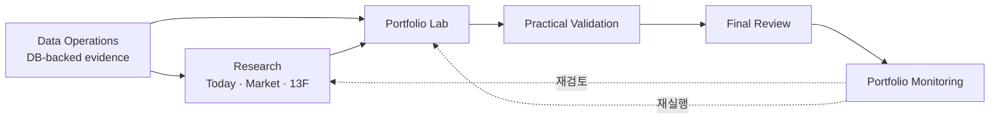
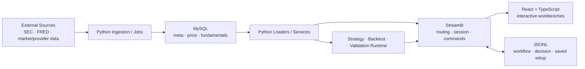

# Quant Data Pipeline

시장 조사, 전략 실험, 실전 검증, 최종 판단, 선정 이후 모니터링을
DB-backed evidence로 연결하는 **Evidence-first 퀀트 투자 리서치 워크스페이스**입니다.

> 좋은 백테스트를 찾는 데서 끝나지 않고, 그 결과를 실제로 계속 관찰할 후보로 받아들여도 되는지 근거와 함께 판단합니다.

현재 active product scope는 `finance` 패키지와 Streamlit 기반 `Finance Console`입니다.
이 프로젝트는 리서치와 의사결정을 지원하지만 broker 연결, 실제 주문, 자동 리밸런싱 또는 수익 보장을 제공하지 않습니다.

## 왜 이 프로젝트를 만들었는가

백테스트 수익률 하나만으로는 실제 추적 가능한 포트폴리오를 고르기 어렵습니다.

- 같은 성과라도 가격·재무·universe 데이터의 기준 시점과 coverage가 다를 수 있습니다.
- 거래 비용, 유동성, ETF holdings, 집중도, stress와 robustness를 확인하지 않으면 실전 운용 가능성을 과대평가할 수 있습니다.
- 시장 환경과 기관 보유 정보는 중요한 배경이지만, 그 자체가 매수·매도 신호나 투자 승인은 아닙니다.
- 후보를 선정한 뒤에도 실제 성과, 종목별 기여, 보유 변화와 재검토 조건을 계속 확인해야 합니다.

Quant Data Pipeline은 이 문제를 `Research → Portfolio Lab → Practical Validation → Final Review → Portfolio Monitoring`의 하나의 흐름으로 다룹니다. 각 단계는 다음 단계가 사용할 근거를 만들며, 실행 결과와 판단 기록은 DB와 명시적인 workflow record 경계를 통해 보존됩니다.

## 현재 무엇을 할 수 있는가

Finance Console의 현재 상단 navigation은 `Research / Portfolio / Data / Help`입니다.

| 영역 | 화면 | 사용자가 끝낼 수 있는 일 |
|---|---|---|
| `Research` | `Today` | 미국 시장 세션, 시장 상태, 대표 포트폴리오 변화와 우선 확인 항목을 첫 화면에서 파악합니다. |
| `Research` | `Market Research` | 경제 사이클, 지수 가치평가, 개별 종목, 변동 종목, 거시·심리·일정을 source와 기준일이 보이는 상태로 조사합니다. |
| `Research` | `Institutional Holdings` | delayed SEC Form 13F로 기관별 자산 배분, 보유 변화, 섹터 노출과 종목별 보유 기관을 탐색합니다. |
| `Portfolio` | `Portfolio Lab` | 전략을 실행·비교하고 portfolio mix를 구성한 뒤 Practical Validation과 Final Review까지 이어갑니다. |
| `Portfolio` | `Portfolio Monitoring` | 선정 후보와 직접 등록한 미국 주식·ETF를 그룹으로 추적하고 성과, 기여도, 보유 변화와 재검토 조건을 확인합니다. |
| `Data` | `Data Operations` | 가격, 재무제표, 거시, ETF provider, 기관 보유 데이터를 MySQL에 수집하고 데이터 준비 상태를 관리합니다. |
| `Help` | `Reference Center` | 제품 개념, 판단 기준, 데이터 제한, 문제 해결 방법과 관련 화면 이동 경로를 검색합니다. |

### Research

`Today`는 매일의 출발점입니다. 미국 시장의 현재 세션과 주요 시장 맥락, 대표 포트폴리오의 최근 변화를 한 번에 읽고 더 깊게 확인할 Research 또는 Portfolio 화면으로 이동합니다.

`Market Research`는 `시장 환경 / 지수 가치평가 / 종목 리서치`를 중심으로 경제 사이클, futures macro, sentiment, events, market movers와 미국 주식 분석을 제공합니다. 저장된 DB evidence와 freshness를 사용하며 자료가 없거나 오래된 상태를 숨기지 않습니다.

`Institutional Holdings`는 SEC Form 13F 공식 data set을 DB에 저장한 뒤 기관별 portfolio와 종목별 보유 기관을 탐색하는 read-only research studio입니다. 13F의 보고 지연, long holdings 중심 범위와 CUSIP-symbol mapping 한계를 항상 함께 봅니다.

### Portfolio

`Portfolio Lab`은 세 단계로 구성됩니다.

1. **Backtest Analysis** — 단일 전략 또는 portfolio mix를 실행하고 비교해 후보 source를 만듭니다.
2. **Practical Validation** — 데이터 신뢰도, 실전 운용성, provider·holdings·macro·stress·robustness 근거와 보강 필요 항목을 확인합니다.
3. **Final Review** — 검증 근거를 종합해 계속 추적, 관찰 후 재검토, 추적 제외 또는 Level 2 재검토 판단을 기록합니다.

`Portfolio Monitoring`은 최종 선정 이후의 read-only 운영 화면입니다. 공통 기준 성과, 종목별 기여, 가격과 보유 변화, diagnosis와 재검토 조건을 확인하지만 주문을 만들거나 자동으로 리밸런싱하지 않습니다.

### Data와 Help

`Data Operations`는 제품 전체를 받치는 evidence 준비 화면입니다. UI에서 provider를 직접 호출해 즉석 계산하지 않고, 수집한 원천 데이터를 MySQL에 저장한 뒤 loader와 service를 통해 Research와 Portfolio workflow에 전달합니다.

`Reference Center`는 별도 매뉴얼을 찾아다니지 않고 현재 화면에서 사용하는 용어, 데이터 기준, 상태 의미와 다음 이동 위치를 검색하는 제품 내 도움말입니다.

## 제품 사용 흐름


```mermaid
flowchart LR
    D["Data Operations<br/>DB-backed evidence"] --> R["Research<br/>Today · Market · 13F"]
    D --> L["Portfolio Lab"]
    R --> L
    L --> V["Practical Validation"]
    V --> F["Final Review"]
    F --> M["Portfolio Monitoring"]
    M -. "재검토" .-> R
    M -. "재실행" .-> L
```

Data Operations는 반드시 처음 한 번만 거치는 설치 단계가 아니라 모든 화면에 근거를 공급하는 기반입니다. Research에서 조사한 맥락은 후보를 해석하는 데 사용하고, Portfolio Lab에서 만든 후보는 검증과 최종 판단을 통과한 경우에만 Monitoring으로 이어집니다.

| 단계 | 입력 | 이 단계에서 끝낼 일 | 다음 단계로 넘기는 것 |
|---|---|---|---|
| Research | 저장된 시장·재무·거시·13F evidence | 현재 환경과 조사 대상을 이해 | 전략·종목·위험에 대한 조사 맥락 |
| Backtest Analysis | DB 가격·재무 데이터와 전략 설정 | 실행 결과를 비교하고 후보 구성 | 재현 가능한 후보 source와 결과 bundle |
| Practical Validation | 후보 source와 validation evidence | 자료 부족, 실전성 문제와 보강 작업 확인 | 최신 validation result와 남은 제한 |
| Final Review | Gate를 통과한 최신 validation | 최종 추적 여부와 사유 기록 | append-only decision과 monitoring 조건 |
| Portfolio Monitoring | 선정 decision 또는 직접 등록한 자산 | 성과·기여·변화를 추적하고 재검토 판단 | Research 재확인 또는 Portfolio Lab 재실행 |

## 현재 제품 경계

이 프로젝트가 제공하는 것은 리서치, 검증, 판단 기록과 선정 이후 모니터링입니다.

제공하지 않는 기능:

- broker account 연결과 실제 보유 자동 동기화
- live trading 승인 또는 주문 생성
- 자동 리밸런싱과 자동 매매
- 수익률 또는 투자 성과 보장
- sentiment, 뉴스, 13F metadata의 자동 매수·매도 신호화
- 모든 provider를 포괄하는 universal connector

`financial_advisor` 디렉터리는 저장소에 남아 있지만 현재 finance 제품 개발의 기본 범위가 아닙니다.

## 5분 빠른 시작

### 준비 사항

| 항목 | 용도 | 필수 범위 |
|---|---|---|
| Python `3.12+` | finance runtime과 Streamlit 앱 | 앱 실행에 필수 |
| [`uv`](https://docs.astral.sh/uv/) | Python 환경과 dependency 관리 | 앱 실행에 필수 |
| local MySQL | 가격·재무·거시·provider·monitoring 데이터 | DB-backed 기능 사용에 필요 |
| Node.js와 npm | React component test, typecheck, production build | frontend를 수정할 때만 필요 |
| provider API 설정 | FRED vintage, SEC identity, OpenFIGI mapping 등 | 해당 데이터를 수집할 때만 필요 |

React production bundle은 `component_static/`에 포함되어 있습니다. 따라서 앱을 처음 실행할 때 npm install이나 frontend 전체 build를 먼저 할 필요는 없습니다.

### 설치와 실행

```bash
uv sync
uv run streamlit run app/web/streamlit_app.py
```

기본 주소는 [http://localhost:8501](http://localhost:8501)입니다. 여러 worktree를 동시에 실행한다면 port를 명시합니다.

```bash
uv run streamlit run app/web/streamlit_app.py --server.port 8510
```

현재 `backtest-dev` worktree의 local QA port는 `8510`입니다.

### 첫 실행 확인

1. 상단에 `Research / Portfolio / Data / Help`가 표시되는지 확인합니다.
2. 기본 route인 `Today`가 열리는지 확인합니다.
3. 데이터가 준비되지 않았다면 unavailable, partial 또는 stale 상태가 명시적으로 표시되는지 확인합니다.
4. 실제 Research와 Portfolio workflow를 사용하기 전 `Data Operations`에서 필요한 DB evidence를 준비합니다.

빈 DB에서도 앱 진입과 자료 부족 상태 확인까지는 가능합니다. 의미 있는 분석 결과를 얻으려면 가격, 재무제표, macro, ETF provider와 필요한 universe 데이터가 먼저 수집되어야 합니다.

### 선택적 provider 설정

프로젝트 root의 `.env`는 외부 수집 기능이 필요할 때만 사용합니다.

```dotenv
FRED_API_KEY=...
SEC_USER_AGENT=Your Name your-email@example.com
OPENFIGI_API_KEY=...
```

- `FRED_API_KEY`는 vintage 기반 경제 데이터 수집에 필요합니다.
- `SEC_USER_AGENT`는 SEC fair-access 정책에 맞는 identity를 명시합니다.
- `OPENFIGI_API_KEY`가 없으면 기관 보유 symbol mapping coverage가 제한될 수 있습니다.

현재 MySQL 연결은 하나의 통합 환경변수 config로 추상화되어 있지 않고 여러 data/service 경로의 local connection contract를 사용합니다. 빈 환경에서 schema와 데이터를 준비할 때는 [Finance Runbooks](.aiworkspace/note/finance/docs/runbooks/README.md)와 `Data Operations`를 기준으로 하며, README는 실제보다 단순한 자동 bootstrap을 약속하지 않습니다.

## 기술 스택과 구현 방식

| 기술 | 현재 역할 |
|---|---|
| Python `3.12+` | ingestion, MySQL persistence, loader, point-in-time 계산, 전략, 백테스트, validation과 read model |
| Streamlit `1.44+` | app navigation, page routing, session state, Python command orchestration과 React event boundary |
| React `18` + TypeScript `5` | Today, Market Research, Institutional Holdings, Portfolio Monitoring과 Backtest workflow의 interactive workbench |
| Vite `6` | Streamlit이 local component로 읽는 React production bundle 생성 |
| MySQL + PyMySQL | 가격, 재무제표, 거시, provider, 기관 보유와 monitoring 데이터의 canonical persistence |
| JSONL | candidate source, validation, Final Review decision, saved setup과 local run history의 workflow 기록 |
| pandas | 시계열 정렬, factor·strategy 계산과 tabular read model |

### 계층별 책임


```mermaid
flowchart LR
    S["External Sources<br/>SEC · FRED · market/provider data"]
    J["Python Ingestion / Jobs"]
    DB["MySQL<br/>meta · price · fundamentals"]
    L["Python Loaders / Services"]
    R["Strategy · Backtest · Validation Runtime"]
    ST["Streamlit<br/>routing · session · commands"]
    UI["React + TypeScript<br/>interactive workbenches"]
    JL["JSONL<br/>workflow · decision · saved setup"]

    S --> J --> DB
    DB --> L
    L --> R
    L --> ST
    R --> ST
    ST --> UI
    ST <--> JL
```

#### Python domain과 application layer

- `finance/data`는 collector, provider adapter, schema와 MySQL write path를 소유합니다.
- `finance/loaders`는 기준일과 coverage를 반영한 DB read path를 소유합니다.
- `finance/transform.py`, `strategy.py`, `engine.py`, `performance.py`는 preprocessing, simulation, orchestration과 성과 계산을 분리합니다.
- `app/jobs`는 수집·자동화·실행 job을, `app/services`는 Streamlit-free application read model과 command boundary를 담당합니다.
- `app/runtime`은 Backtest runner와 runtime orchestration을 UI에서 분리합니다.

#### Streamlit application shell

Streamlit은 `app/web/streamlit_app.py`에서 top-level route를 구성하고 Python session·command를 조정합니다. 데이터 수집, Gate 계산과 persistence authority는 Python에 남기며, React에 JSON-safe payload와 작은 event envelope만 전달합니다.

#### React workbench

React와 TypeScript는 복잡한 화면 탐색, local selection, chart, responsive layout과 명시적인 사용자 intent를 담당합니다. React component는 MySQL이나 provider를 직접 호출하지 않고 validation·Final Review·Monitoring 상태를 독자적으로 계산하거나 저장하지 않습니다.

Python이 server state를 다시 읽어야 하는 동작만 Streamlit event boundary를 넘습니다. 화면 안에서 끝나는 tab, filter, hover와 presentation state는 가능한 React local state로 유지합니다.

## 프로젝트 구조

```text
app/
  jobs/                         # ingestion, automation, execution jobs
  services/                     # Streamlit-free application/read-model layer
  runtime/                      # Backtest runners and runtime orchestration
  web/                          # Streamlit pages and React adapters
    streamlit_components/       # page-level React/TypeScript workbenches
    components/*/frontend/      # Backtest workflow React components

finance/
  data/                         # collectors, provider adapters, MySQL writes
  data/db/                      # MySQL client and schema definitions
  loaders/                      # DB-backed read paths
  transform.py                  # signals, factors, ranking, preprocessing
  strategy.py                   # portfolio simulation and rebalancing
  engine.py                     # strategy orchestration
  performance.py                # performance metrics

tests/                          # Python domain, service and UI-boundary contracts

.aiworkspace/note/finance/
  docs/                         # durable product, architecture, data and runbook knowledge
  tasks/active/                 # task plan, status, runs and risks
  phases/active/                # multi-task phase integration when explicitly opened
  researches/active/            # product direction and benchmark research
  reports/backtests/            # human-readable strategy and run reports
  registries/                   # append-only workflow records
  saved/                        # reusable user portfolio setups
  run_history/                  # local execution history
```

더 세밀한 file ownership은 [Project Map](.aiworkspace/note/finance/docs/PROJECT_MAP.md)에서 확인합니다.

## 데이터와 저장 경계

| 저장 위치 | 역할 | 정책 |
|---|---|---|
| MySQL `finance_meta` | universe, asset profile, provider snapshot, macro, events, 13F와 운영 metadata | canonical metadata / evidence source |
| MySQL `finance_price` | 주식·ETF·futures 가격, 거래량과 corporate action history | canonical price source |
| MySQL `finance_fundamental` | raw filing, financial statement와 derived factor | canonical fundamental source |
| `.aiworkspace/note/finance/registries/*.jsonl` | candidate, validation과 decision workflow record | append-only, 임의 재작성 금지 |
| `.aiworkspace/note/finance/saved/*.jsonl` | reusable portfolio와 monitoring setup | 사용자 설정으로 보존 |
| `.aiworkspace/note/finance/run_history/*.jsonl` | local execution history | 보통 commit하지 않음 |
| `.aiworkspace/note/finance/run_artifacts/` | local job artifact와 diagnostic output | 보통 commit하지 않음 |
| `.aiworkspace/note/finance/reports/backtests/` | 사람이 읽는 전략·실행 근거 | registry나 saved source를 대체하지 않음 |

## 데이터 신뢰성과 투자 경계

- **Point-in-time correctness** — 각 기준일에 실제로 알 수 있었던 데이터만 사용하도록 설계합니다.
- **Look-ahead bias** — 미래 발표값, 수정된 vintage 또는 이후 universe 정보를 과거 판단에 섞지 않습니다.
- **Survivorship bias** — 현재 상장 종목 목록만으로 historical universe가 완전하다고 가정하지 않습니다.
- **Visible evidence state** — source, freshness, coverage와 partial·stale·unavailable 상태를 숨기지 않습니다.
- **`NOT_RUN` is not pass** — 데이터나 구현이 없어 실행하지 못한 검증은 통과가 아닙니다.
- **Context is not approval** — macro, sentiment, events, news와 13F는 조사 근거이지 자동 투자 신호가 아닙니다.
- **DB before UI** — 기본 경로는 `Ingestion → DB → Loader / Service → Runtime → UI`이며 UI에서 provider를 직접 fetch하지 않습니다.

이 원칙은 높은 수익률보다 evidence quality와 재현 가능한 판단 경로를 우선하기 위한 것입니다.

## 개발과 검증

### Python

변경한 domain의 focused suite를 실행합니다.

```bash
uv run python -m unittest tests.test_today_home
```

pytest 기반 파일은 project root import 경계를 명시해 실행할 수 있습니다.

```bash
PYTHONPATH=. uv run --with pytest python -m pytest tests/test_today_home.py -q
```

### React와 TypeScript

각 component directory에서 제공하는 script를 사용합니다.

```bash
npm run typecheck
npm run test
npm run build
```

component마다 지원하는 script가 다르므로 해당 `package.json`을 먼저 확인합니다. production build 결과인 `component_static/`은 Streamlit이 직접 읽는 배포 자산이며, component를 수정했다면 source와 함께 검증합니다.

### 공통 확인

```bash
git diff --check
git status --short
```

generated QA image, run history, local experiment output, registry와 saved setup은 명시적인 사용자 요청 없이 stage하지 않습니다.

## 상세 문서

README는 제품의 첫 관문이며 빠르게 변하는 active task 상태를 복제하지 않습니다.

| 목적 | 문서 |
|---|---|
| 문서 전체 진입점 | [Finance Documentation Index](.aiworkspace/note/finance/docs/INDEX.md) |
| 제품 목표와 non-goal | [Product Direction](.aiworkspace/note/finance/docs/PRODUCT_DIRECTION.md) |
| 현재 개발 상태와 다음 결정 | [Roadmap](.aiworkspace/note/finance/docs/ROADMAP.md) |
| code ownership과 entry point | [Project Map](.aiworkspace/note/finance/docs/PROJECT_MAP.md) |
| layer와 UI-engine 경계 | [Architecture](.aiworkspace/note/finance/docs/architecture/README.md) |
| 데이터 의미와 schema 지도 | [Data Documentation](.aiworkspace/note/finance/docs/data/README.md) |
| Backtest 화면과 stage 책임 | [Backtest UI Flow](.aiworkspace/note/finance/docs/flows/BACKTEST_UI_FLOW.md) |
| 후보 생성부터 Monitoring까지 | [Portfolio Selection Flow](.aiworkspace/note/finance/docs/flows/PORTFOLIO_SELECTION_FLOW.md) |
| Institutional 13F 사용자 흐름 | [Institutional Holdings Flow](.aiworkspace/note/finance/docs/flows/INSTITUTIONAL_PORTFOLIOS_FLOW.md) |
| 실행·수집·QA 절차 | [Finance Runbooks](.aiworkspace/note/finance/docs/runbooks/README.md) |
| 전략과 backtest report | [Backtest Reports](.aiworkspace/note/finance/reports/backtests/INDEX.md) |
| 현재 실행 task | [Active Task Index](.aiworkspace/note/finance/tasks/active/README.md) |

Codex 또는 agent가 이 저장소에서 작업할 때는 [AGENTS.md](AGENTS.md), Documentation Index, Roadmap과 Project Map을 먼저 확인합니다.
